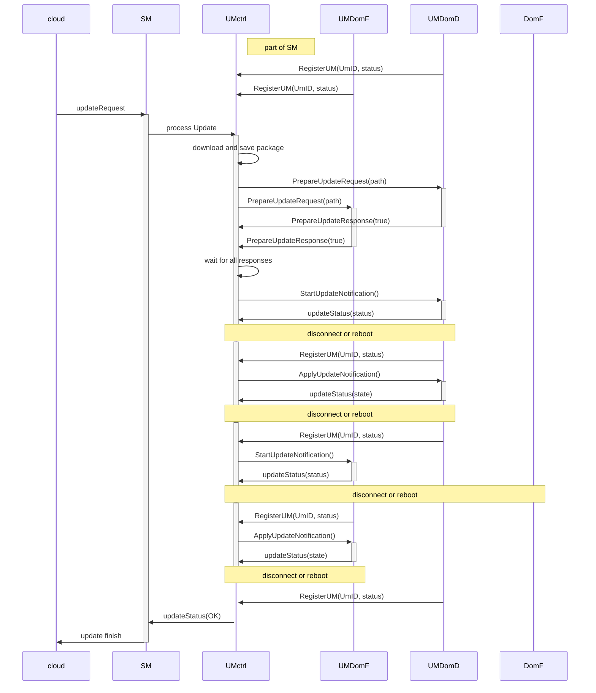

# UM Protocol

To trigger update procedure Update manager should implements client's part of update protocol.
**System manager** implements server part of UM protocol.
Communication between SM and UM done using [gRPC framework](https://grpc.io/).

## Upgrade sequence

On startup each Update manager should subscribe on notifications about update requests. Returned gRPC stream should be used fro upcoming communications.

